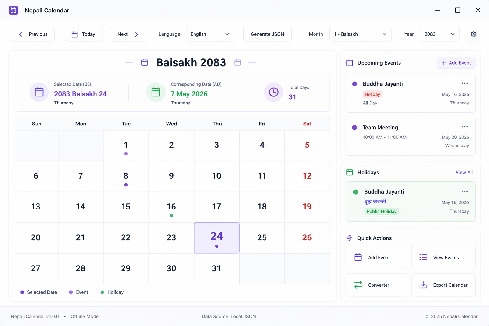

# Nepali Calendar


A modern **Nepali (Bikram Sambat) calendar** for Windows, built with WPF on .NET 10. It pairs a full dashboard with lightweight, always-on-top desktop widgets so the current BS date is never more than a glance away.



## Features

- 📅 **Bikram Sambat calendar** with accurate BS↔AD conversion (verified round-trips), month/date navigation, and keyboard arrows.
- 🧩 **Three desktop widgets** (Small, Medium, Large) — drag to position, remembers where you put each, switches size, and refreshes at midnight.
- 🔔 **System tray icon** — the app lives in the tray, so closing a widget never loses it. Re-open a widget, open the calendar, or quit from the tray menu.
- 📝 **Events** — create, edit, and delete events (persisted locally); they appear on the dashboard, on calendar dots, and on the large widget.
- 🔄 **Date converter** — convert any date between BS and AD, both directions, live.
- ⬇️ **Export** — export your events to **iCalendar (.ics)** or **CSV**.
- 🌐 **English / नेपाली** — switch language anywhere; Nepali mode uses Nepali numerals.
- ⚙️ **Settings** — language, default widget size, and "Start with Windows".
- 🛡️ **Resilient** — graceful handling of out-of-range dates and a global error handler so a hiccup never takes the app down.

## Requirements

- Windows 10/11
- [.NET 10 SDK](https://dotnet.microsoft.com/download) (to build) or the .NET 10 Desktop Runtime (to run a published build)

## Running from source

```powershell
git clone https://github.com/Nelessx/CalanderAppWin.git
cd CalanderAppWin
dotnet run --project CalanderAppWin
```

A widget appears first — right-click it (or use the tray icon) and choose **Open App** for the full dashboard.

## Building a release

Framework-dependent (needs the .NET 10 Desktop Runtime on the target machine):

```powershell
dotnet publish CalanderAppWin/NepaliCalendar.App.csproj -c Release -r win-x64 --self-contained false
```

Self-contained, single file (no runtime install required):

```powershell
dotnet publish CalanderAppWin/NepaliCalendar.App.csproj -c Release -r win-x64 `
  --self-contained true -p:PublishSingleFile=true
```

The build is pinned to the .NET SDK in [`global.json`](global.json), and every push/PR
to `main` is built and tested by [GitHub Actions](.github/workflows/ci.yml).

> **Not yet packaged:** a signed installer (MSIX/Inno), auto-update, and code
> signing are planned but require external accounts (a code-signing certificate,
> an update feed) and are not part of this repository yet.

## Project layout

```
CalanderAppWin/
  App.xaml(.cs)            App startup, tray icon, global error handling
  MainWindow.xaml(.cs)     The dashboard
  Widget*.xaml(.cs)        Small / Medium / Large desktop widgets
  Views/                   Add-event, event-list, converter, settings dialogs
  Services/                Date conversion, event store, export, localization, settings, startup, tray
  Models/                  Data models
  Data/                    Bikram Sambat calendar data (BS 2081–2087)
  Assets/                  App icon
NepaliCalendar.Tests/      Unit tests (xUnit)
Design/                    UI mockups
```

## Testing

```powershell
dotnet test
```

## Data range

The bundled calendar data covers **BS 2081–2087** (≈ AD 2024–2031). Outside this range the app degrades gracefully rather than failing. To extend it, add rows to `CalanderAppWin/Data/bs-calendar-raw.txt` and regenerate the JSON.

## License

Released under the [MIT License](LICENSE).
